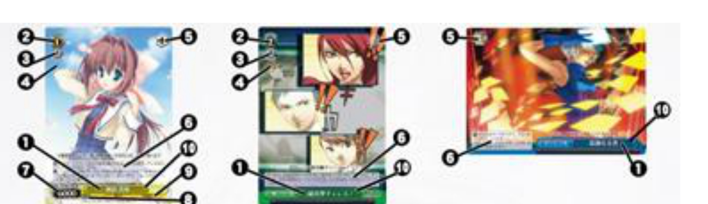

<!--
원본: 바이스슈발츠 종합 룰 ver.1.111 (2026-05-19) / 2. カードの情報
용어: ../../GLOSSARY.md 기준. 번호 체계·괄호(「」『』《》)는 원문 그대로 유지.
아이콘 심볼은 PDF 글리프 누락으로 [○○ 아이콘] 형태로 표기.
-->

# 2. 카드 정보

> 위 도해는 왼쪽부터 **캐릭터 · 이벤트 · 클라이맥스** 카드입니다. 카드 종별에 따라 지니는 정보가 다르며, 각 번호의 부분은 다음과 같습니다.

| 종별 | 각 부분의 명칭 |
|------|----------------|
| **캐릭터** | ① 카드명 · ② 레벨 · ③ 코스트 · ④ 아이콘 · ⑤ 트리거 아이콘 · ⑥ 텍스트 · ⑦ 파워 · ⑧ 소울 · ⑨ 특징 · ⑩ 색 |
| **이벤트** | ① 카드명 · ② 레벨 · ③ 코스트 · ④ 아이콘 · ⑥ 텍스트 · ⑩ 색 |
| **클라이맥스** | ① 카드명 · ⑤ 트리거 아이콘 · ⑥ 텍스트 · ⑩ 색 |

## 2.1. 카드명

- **2.1.1.** 이 카드가 가진 고유 명칭입니다.
  - **2.1.1.1.** 카드명에, 그 카드의 읽는 법을 나타내는 후리가나가 붙어 있는 경우가 있습니다만, 이것은 카드명의 일부가 아닙니다.
  - **2.1.1.2.** 카드명이 적혀 있어야 할 자리에, 취소선이나 칠하기 등으로 지워진 문자가 표기되어 있는 것이 있습니다. 이로 인해 명확히 지워진 부분은, 카드명의 일부로 취급하지 않으며, 카드명을 참조하는 경우 그 부분을 존재하지 않는 것으로 취급합니다.
- **2.1.2.** 텍스트 중에 특별히 정보 종별의 지정 없이 「」(낫표)로 묶어 지정된 것이 있는 경우, 그 카드명을 가진 카드를 참조합니다.
  - **2.1.2.1.** 『카드명에 「(명칭)」을 포함』이라고 적혀 있는 경우, 「」(낫표)로 묶은 부분은 카드명의 일부를 나타내는 어구를 의미합니다.

## 2.2. 일러스트

- **2.2.1.** 카드의 내용을 이미지화한 일러스트입니다.
- **2.2.2.** 일러스트는, 게임상 특별한 의미를 갖지 않습니다.
- **2.2.3.** 텍스트의 위(텍스트가 없는 카드의 경우는 카드명의 위)에, 게임과 관계없는 문장이 적혀 있는 것이 있습니다. 이 문장은 플레이버라고 불리며, 일러스트의 일부로 간주됩니다.

## 2.3. 종별

- **2.3.1.** 이 카드의 종별을 나타내는 정보입니다.
- **2.3.2.** 종별은 「캐릭터」 「이벤트」 「클라이맥스」의 3종류가 있습니다. 카드의 종별은, 카드명의 왼쪽에, 검은 바탕에 흰 글자의 약칭으로 표시되어 있습니다.
  - **2.3.2.1.** 종별 「캐릭터」인 카드는, 인물이나 캐릭터를 의미합니다.
    - **2.3.2.1.1.** 종별 캐릭터인 카드에는, 카드명의 왼쪽에 「[캐릭터 아이콘]」이라고 적혀 있습니다.
    - **2.3.2.1.2.** 카드의 텍스트에, 영역을 특별히 지정하지 않고 『캐릭터』라고 표기된 경우, 그것은 『무대에 놓여 있는 종별 「캐릭터」인 카드』를 의미합니다.
  - **2.3.2.2.** 종별 「이벤트」인 카드는, 게임 중에 일어나는 다양한 사건을 의미합니다.
    - **2.3.2.2.1.** 종별 이벤트인 카드에는, 카드명의 왼쪽에 「[이벤트 아이콘]」이라고 적혀 있습니다.
  - **2.3.2.3.** 종별 「클라이맥스」인 카드는, 게임 중에 일어나는 다양한 극적인 사건을 의미합니다.
    - **2.3.2.3.1.** 종별 클라이맥스인 카드에는, 카드명의 왼쪽에 「[클라이맥스 아이콘]」이라고 적혀 있습니다.
    - **2.3.2.3.2.** 카드의 텍스트에, 영역을 특별히 지정하지 않고 『클라이맥스』라고 표기된 경우, 그것은 『클라이맥스 존에 놓여 있는 종별 「클라이맥스」인 카드』를 의미합니다.
    - **2.3.2.3.3.** 텍스트에서, 「클라이맥스」라는 말이 「CX」로 표기되는 경우가 있습니다.

## 2.4. 색

- **2.4.1.** 이 카드의 색을 나타내는 정보입니다.
- **2.4.2.** 카드의 색은, 카드를 플레이하기 위한 제한이 될 수 있습니다. 자세히는 후술 「카드의 플레이」를 참조해 주세요.

## 2.5. 특징

- **2.5.1.** 이 카드가 가진 특징을 나타내는 정보입니다. 이 정보는, 종별 「캐릭터」를 가진 카드만이 가집니다.
- **2.5.2.** 특징은 룰상 특별한 의미를 갖지 않는 정보입니다만, 다른 능력이나 효과에 의해 참조되는 경우가 있습니다.
- **2.5.3.** 텍스트 중에 특별히 정보 종별의 지정 없이 《》(겹화살괄호)로 묶어 지정된 것이 있는 경우, 그 특징을 가진 카드를 참조합니다.

## 2.6. 레벨

- **2.6.1.** 이 카드를 플레이하기 위한 필요 레벨을 나타내는 정보입니다. 이 정보는, 종별 「캐릭터」 「이벤트」를 가진 카드가 가집니다.
- **2.6.2.** 레벨은 이 카드를 플레이하기 위한 제한이 될 수 있습니다. 자세히는 후술 「카드나 능력의 플레이와 해결」을 참조해 주세요.

## 2.7. 코스트

- **2.7.1.** 이 카드를 플레이하기 위한 코스트를 나타내는 정보입니다. 이 정보는, 종별 「캐릭터」 「이벤트」를 가진 카드가 가집니다.
  - **2.7.1.1.** 능력이나 효과에 의해, 이 코스트는 특별히 「(이 카드의 종별)의 코스트」 혹은 「(이 카드의 카드명)의 코스트」로서 참조됩니다.
- **2.7.2.** 이 카드를 플레이하기 위해서는, 코스트에 표시된 수와 같은 매수의 카드를 스톡 존에서 대기실로 이동시킬 필요가 있습니다. 자세히는 후술 「카드나 능력의 플레이와 해결」을 참조해 주세요.

## 2.8. 아이콘

- **2.8.1.** 여기에는, 카드의 기능을 설명하는 아이콘이 그려지는 경우가 있습니다.
- **2.8.2.** 여기에 카운터 아이콘([카운터 아이콘])이 존재하는 카드는, 상대 턴 중의 카운터 스텝에 사용할 수 있음을 의미합니다.
  - **2.8.2.1.** 특별히 지정이 없는 한, 카운터 아이콘이 있는 카드를 자신의 턴에 사용하는 것이 가능합니다.
- **2.8.3.** 여기에 클록 아이콘([클록 아이콘])이 존재하는 카드는, 클록 존(3.8)에 있는 경우에 의미를 갖는 능력을 가진 카드입니다.

## 2.9. 파워

- **2.9.1.** 이 카드의 배틀에서의 강함을 나타내는 정보입니다. 자세히는 후술 「어택과 배틀」을 참조해 주세요. 이 정보는, 종별 「캐릭터」를 가진 카드만이 가집니다.

## 2.10. 소울

- **2.10.1.** 이 카드가 플레이어에게 주는 데미지의 기준값을 나타내는 정보입니다. 자세히는 후술 「어택과 배틀」을 참조해 주세요. 이 정보는, 종별 「캐릭터」를 가진 카드만이 가집니다.
- **2.10.2.** 소울의 표기는 수치가 아니라 소울 아이콘([소울 아이콘])의 수로 표시됩니다.

## 2.11. 트리거 아이콘

- **2.11.1.** 어택 페이즈의 트리거 스텝에서 이 카드가 공개된 경우의 효과를 나타내는 아이콘입니다. 자세히는 후술 「어택과 배틀」을 참조해 주세요.

## 2.12. 텍스트

- **2.12.1.** 이 카드가 가진 고유의 능력을 나타내는 정보입니다.
- **2.12.2.** 특정 종별의 텍스트는, 특별히 지시가 없는 경우, 특정 영역에서만 유효합니다.
  - **2.12.2.1.** 종별 「캐릭터」인 카드에 적혀 있는 텍스트는, 원칙적으로 그 캐릭터가 무대에 놓여 있는 경우에만 유효합니다.
  - **2.12.2.2.** 종별 「클라이맥스」에 적혀 있는 텍스트는, 원칙적으로 그 카드가 클라이맥스 존에 놓여 있는 경우에만 유효합니다.
  - **2.12.2.3.** 어떤 영역에서 사용되는 것이 전제인 능력은, 추가로 그 영역에서도 유효합니다.
    - **2.12.2.3.1.** 무대 이외에서 유효한 능력으로, 능력을 그 능력을 가진 카드 자신에게 부여하는 능력이 있습니다. 그 능력으로 얻은 능력은, 능력을 부여한 능력이 유효한 영역에서도 유효하며, 그 영역에서 벗어남으로써 유발되는 능력도 유효합니다.
- **2.12.3.** 텍스트 중에는, ()(소괄호)로 묶인, 키워드나 키워드 능력이나 카드의 능력을 자세히 설명한 것이 존재하는 경우가 있습니다. 이것은 주석문이라고 불리는 것입니다. 주석문은 텍스트의 일부입니다만, 어디까지나 능력의 해설 목적만의 의미를 가지며, 게임에는 영향을 주지 않습니다.

## 2.13. 작품명

- **2.13.1.** 이 카드의 원본이 된 작품명입니다. 작품명은, 원칙적으로, 캐릭터 카드나 이벤트 카드의 경우 카드명의 오른쪽에, 클라이맥스 카드의 경우 카드의 오른쪽 위에 적혀 있습니다.
- **2.13.2.** 작품명은 룰상 특별한 의미를 갖지 않는 정보입니다만, 다른 능력이나 효과에 의해 참조되는 경우가 있습니다.

## 2.14. 컬렉션 ID

- **2.14.1.** 이 카드의 ID 기호입니다. 이것은 카드 종별의 오른쪽에, 일련의 영숫자 기호로 표시되어 있습니다.
- **2.14.2.** 컬렉션 ID는, 게임상 특별한 의미를 갖지 않습니다.

## 2.15. 레어도

- **2.15.1.** 이 카드의, 팩에서의 등장 빈도입니다. 이것은 컬렉션 ID의 오른쪽에, 알파벳으로 표시되어 있습니다.
- **2.15.2.** 레어도는, 게임상 특별한 의미를 갖지 않습니다.

## 2.16. 일러스트레이터

- **2.16.1.** 이 카드의 일러스트 저작자입니다. 이것은 카드의 최하단에 적혀 있습니다.
- **2.16.2.** 일러스트레이터는, 게임상 특별한 의미를 갖지 않습니다.

## 2.17. 저작권 표기

- **2.17.1.** 이 카드의 저작권 표기입니다. 이것은 카드의 최하단에 적혀 있습니다.
- **2.17.2.** 저작권 표기는, 게임상 특별한 의미를 갖지 않습니다.

## 2.18. 사이드 칸

- **2.18.1.** 일러스트레이터(2.16)나 저작권 표기(2.17)가 적혀 있는 부분의 배경색은, 이 카드가 바이스 사이드와 슈발츠 사이드 중 어느 쪽에 소속되는지를 나타냅니다.
  - **2.18.1.1.** 배경이 흰색인 경우, 이 카드는 바이스 사이드에 속합니다.
  - **2.18.1.2.** 배경이 검은색인 경우, 이 카드는 슈발츠 사이드에 속합니다.
  - **2.18.1.3.** 배경이 흰색에서 검은색으로의 그러데이션인 경우, 이 카드는 바이스 사이드와 슈발츠 사이드 양쪽에 속합니다.
- **2.18.2.** 사이드 칸이나 속하는 사이드는 룰상 특별한 의미를 갖지 않는 정보입니다만, 다른 능력이나 효과에 의해 참조되는 경우가 있습니다.

## 2.19. 정보의 참조

- **2.19.1.** 카드가 어떤 정보를 갖지 않고, 어떠한 룰이나 효과가 그 정보를 참조하는 경우, 그것이 본래 수치인 경우는 0, 그렇지 않은 경우는 존재하지 않는 상태를 참조합니다.
- **2.19.2.** 어떤 수치가 아닌 정보를 비교할 때, 그 적어도 어느 한쪽이 존재하지 않는 상태인 경우, 그것은 동일하다고 간주하지 않습니다.
